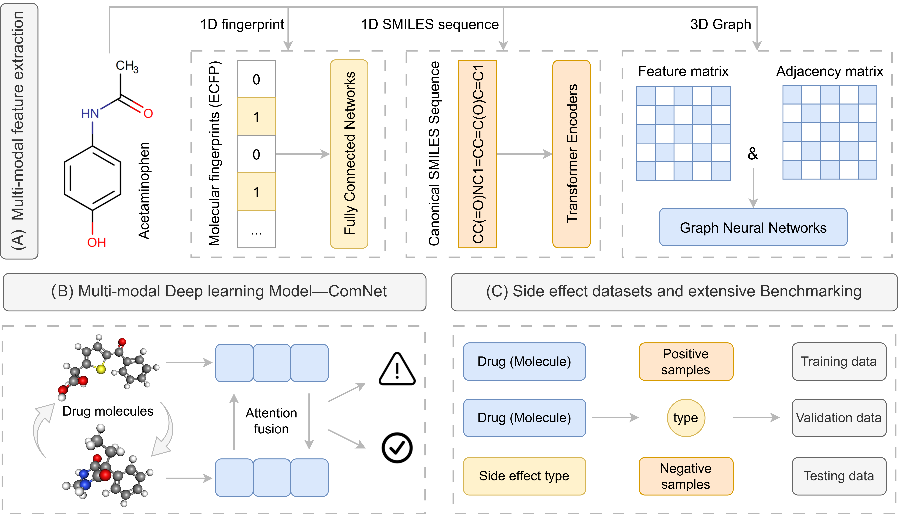

# ComNet: A Multiview Deep Learning Model for Predicting Drug Combination Side Effects

[]()
[]()
[]()
[]()
<div align="center">
  
</div>

# Introduction
In the treatment of complex diseases, a single drug often cannot provide sufficient efficacy. As a result, combination therapy has become a common approach. However, combining multiple drugs increases the likelihood of drug-drug interactions (DDIs), which may not only alter the efficacy of the drugs but also lead to harmful side effects ⚠️. Identifying potential DDIs systematically is crucial for improving therapeutic efficacy and ensuring patient safety 🏥. While DDIs can be detected through laboratory or clinical trials, these methods are often time-consuming and labor-intensive ⏳. Consequently, the development of fast and accurate DDI prediction methods has become a critical task 🚀.
<div align="center">
  
</div>
To address this challenge, we propose ComNet, a novel deep learning model designed to predict drug side effects 💊. ComNet leverages a weight-sharing multi-view feature extraction network to capture the multidimensional characteristics of drugs. The model takes drug combinations and side effect types as input and predicts the probability of side effect occurrence 📊. ComNet consists of three primary modules: the feature embedding layer, the feature fusion layer, and the prediction layer.Overall, ComNet represents a promising tool for the early detection of safety concerns during drug development 🧬, assisting clinicians in evaluating the safety profiles of drug combinations in clinical settings 👨‍⚕️👩‍⚕️.

## 🔧 Setup and Usage

Follow the steps below to prepare your environment, run the model, and utilize the results.

### 1. Clone the Repository

To get started, clone this repository to your local machine:

```bash
git clone https://github.com/yourusername/comnet.git
cd comnet
```
### 2. Install Dependencies
Ensure that you have the following dependencies:
```bash
- Python 3.7+
- PyTorch 1.10 or higher
- Torch-Geometric 2.3.1+
- RDKit for chemical informatics
- Additional libraries such as tqdm, tabulate, and yaml
```
### 3. Prepare the Dataset
You can use datasets like `DrugBank`, `Twosides`, or any custom `DDI dataset`. To get started, you'll need to preprocess your data. The preprocessing steps can be found in the `src/tools/data_preprocessing.py` script. The dataset should include:
- Molecular fingerprints
- SMILES sequences
- 3D graph representations

If you're using a custom dataset, make sure to align the data format with the expected structure.

### 4. Configure the Model
Configure the model parameters using the `config.yaml` file. This includes specifying the dataset, model hyperparameters (e.g., hidden dimensions, dropout rate), and training configurations (e.g., batch size, learning rate).
```yaml
model:
  name: "ComNet-DDI"
  hidden_dim: 64
  dropout: 0.2
  rmodule_dim: 128

training:
  epochs: 500
  batch_size: 256
  lr: 0.001
  weight_decay: 0.0005
  iter_metric: "f1"

dataset:
  name: "ddi"
  data_root: "data/preprocessed/"

device:
  gpu: "0"

save_dir: "save"
paths:
  model_path: "save/best_model.pth"
  result_path: "results/test_results.txt"
```
### 5. Train the Model
Once the dataset is ready and the configuration is set, you can start training the model:
```shell
python train.py --config config.yaml
```
### 5. Test the Model
After training, you can use the following command to test the model and evaluate its performance on the test set:
```shell
python test.py --config config.yaml
```

## 🔎 Use Cases
ComNet can be applied in several ways to enhance drug safety evaluation:

- Early identification of potential drug side effects 💥: Helps pharmaceutical researchers identify risky drug combinations before clinical trials.
- Drug safety assessment in clinical settings 🏥: Clinicians can use the model to evaluate the safety profiles of drug combinations.
- Drug discovery 🧬: By predicting DDIs and their associated side effects, ComNet can be part of the drug discovery pipeline to prioritize safer drug candidates.

## ❓ Frequently Asked Questions (FAQ)
### 1. How do I prepare my own dataset for training?
Ensure your dataset includes:
- Molecular fingerprints in a format that can be processed by the model.
- SMILES sequences.
- 3D graph representations. You can refer to the `data_preprocessing.py` script for preprocessing details.
### 2. What kind of hardware do I need to run ComNet?
While ComNet can run on CPU, we recommend using a GPU (CUDA-enabled) for faster training. Ensure that your system has a compatible GPU and that PyTorch with CUDA support is properly installed.
### 3. How can I change the evaluation metric?
The evaluation metric is controlled through the `iter_metric` field in the `config.yaml` file. You can choose from:
- f1: F1 score (default)
- accuracy: Accuracy
- auc: Area under the curve (AUROC)
- score: Custom combination of metrics like AUROC and AP
### 4. Can I use ComNet for other types of predictions?
ComNet is designed specifically for predicting side effects caused by drug combinations. If your dataset includes a wide range of side effects, the model will be able to predict more complex and varied interactions between drugs.

## 📄 Citation
If you use ComNet in your research or have been inspired by it, please cite the following paper:
```text
@ARTICLE{Zhang2025-lz,
  title     = "{ComNet}: A Multiview Deep Learning Model for Predicting Drug
               Combination Side Effects",
  author    = "Zhang, Zuolong and Liu, Fang and Shang, Xiaonan and Chen,
               Shengbo and Zuo, Fang and Wu, Yi and Long, Dazhi",
  journal   = "J. Chem. Inf. Model.",
  publisher = "American Chemical Society",
  month     =  jan,
  year      =  2025
}

```